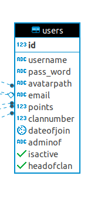
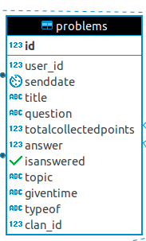
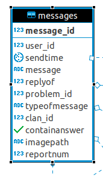
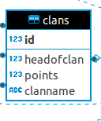
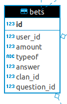
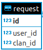

Developper Guide
================

In this developper guide, technical details of solveBet will be explained. To see live demo please go to ''https://itucsdb1827.herokuapp.com/''

Used Python Packages
--------------------

In this project,

- Flask-WTF is used for form validation
- passlib is used for password encyrption
- Werkzeug is used for secure file uploads
- Flask is used as Microframework for creation of website.

users Table
-----------

In this table, attributes of users stored. Attributes of users and explanation is given bellow.

     Overview of users table

- integer id: primary key of users table.
- varchar username: nickname of user. It has to be unique.
- varchar pass_word: encyrpted password of user.For encyription passlib library is used
- varchar avatarpath: file location of users avatar.
- varchar email: email of user. It has to be unique.
- integer points : total points of user.
- integer clannumber: clan id of user. If user is not a member a clan it is NULL. It is a foreign key to clans table.
- timestamp dateofjoin: date of join of user. UTC timestamp according Greenwich.
- varchar adminof: user can be admin.There are 6 different value for this: phy(physics) ,m(math), ds(Data Structure), algo(Algorithm), general and NULL.
- boolean isactive: user logged in or not.
- boolean headofclan: user headofclan or not.

In 'server.py' line 603 create operation on users table is performed.

.. code-block:: python

   statement="""INSERT INTO users(username,pass_word,avatarpath,email,isActive) 
   VALUES(%s,%s,%s,%s,TRUE)"""
   cursor.execute(statement,(str(form.username.data),str(crypt),str(filename),
   str(form.email1.data)))

In 'server.py' line 128 delete operation on users table is performed.

.. code-block:: python

   with psycopg2.connect(adress) as conn:
        cursor=conn.cursor()
        statement="""DELETE FROM users WHERE username=%s"""
        cursor.execute(statement,(username,))

In 'server.py' line 1310 update operation on users table is performed.

.. code-block:: python

   statement="""UPDATE users SET pass_word=%s WHERE id=%s"""
   crypt=hasher.hash(formP.password2.data)
   cursor.execute(statement,(crypt,var))

In 'server.py' line 68 read operation on users table is performed.

.. code-block:: python

   with psycopg2.connect(adress) as conn:
        cursor=conn.cursor()
        statement="""SELECT *FROM users WHERE id=%s"""
        cursor.execute(statement,(id,))

.. note::
   There is multiple read and update operation which is performed in different locations.

problems table
--------------

In this table, attributes of problems stored. Attributes of problems and explanation is given bellow.

     Overview of problems table

- integer id: Primary key of problems table.
- integer user_id: Asker of question. It is a foreign key to users table.
- timestamp senddate: Date of problems creation. UTC timestamp according Greenwich.
- varchar title: Title of question.
- varchar question: Content of question.
- int totalcollectedpoints: Total amount of all bets for this question.
- double answer: Answer of question.
- boolean isanswered: Question answered or not.
- varchar topic: There are 4 different options: phy(physics) ,m(math), ds(Data Structure), algo(Algorithm).
- varchar giventime: Given amount of time to user to answer question.
- varchar typeof: It is for problems or clan disqussion.(see user guide for more explanation)
- integer clan_id: If it is for clan disqussion, clan id will be appeared. Otherwise it is NULL. It is foreign key to clans table.

In 'server.py' line 930 create operation on problems table is performed.

.. code-block:: python

   with psycopg2.connect(adress) as conn:
   	cursor=conn.cursor()            
        statement="""INSERT INTO problems(user_id,title,question,totalcollectedpoints,
	answer,topic,giventime,typeof) VALUES (%s,%s,%s,%s,%s,%s,%s,%s)"""
        cursor.execute(statement,(UserNameToId(session['user']),str(form.title.data),
	str(form.question.data),
        0,str(form.answer.data),str(form.topic.data),str(form.time.data),'general'))
                

In 'server.py' line 471 delete operation on problems table is performed.

.. code-block:: python

   with psycopg2.connect(adress) as conn:
        cursor=conn.cursor()
        statement="""DELETE FROM problems WHERE id=%s"""
        cursor.execute(statement,(qid,))

In 'server.py' line 564 update operation on problems table is performed.

.. code-block:: python

   with psycopg2.connect(adress) as conn:
        cursor=conn.cursor()
        statement="""UPDATE problems SET title=%s,topic=%s,giventime=%s,
	question=%s,answer=%s WHERE id=%s""" ## pre populate some field
        cursor.execute(statement,(str(form.title.data),str(form.topic.data),
	str(form.time.data),str(form.question.data),form.answer.data,qid))

In 'server.py' line 109 read operation on problems table is performed.

.. code-block:: python

   with psycopg2.connect(adress) as conn:
        cursor=conn.cursor()
        statement="""SELECT *FROM problems WHERE id=%s"""
        cursor.execute(statement,(pid,))

.. note::
   There is multiple read and update operation which is performed in different locations.

messages Table
--------------

In this table, attributes of messages stored. Attributes of messages and explanation is given bellow.

     Overview of messages table

- integer message_id: Primary key of messages table.
- integer user_id: Creator of message. It is a foreign key to users table.
- timestamp sendtime: Send time of message. UTC timestamp according Greenwich.
- varchar message: Content of message.
- integer replyof: If message is reply of another message,replied message's id will be strored, otherwise it will be NULL. It is foreign key to messages table.
- integer problem_id: Id of problem that messsage belongs. It is foreign key to problems table.
- varchar typeofmessage: Clan message or problem message.
- integer clan_id: If it is a clan message clan id will be stored, otherwise it is NULL. It is foreign key to clans table.
- boolean containanswer: If user mark 'Might include Answer' it will become true, otherwise it is false.
- varchar imagepath: User can add image to message.If user adds a image to the message, file location will be stored in this attribute.
- integer reportnum: By clicking 'Report User' button in right side of message, this will be increased by 1. If this attribute reachs more than o equal 5, admin of topic can  delete this message.

In 'server.py' line 829 create operation on messages table is performed.

.. code-block:: python

   with psycopg2.connect(adress) as conn2:
   	if f is not None: ## if reply of something
   		cursor2=conn2.cursor()
                statement2="""INSERT INTO messages(user_id,message,replyof,problem_id,
		typeofmessage,containanswer,imagepath) VALUES(%s,%s,%s,%s,%s,%s,%s)"""
                cursor2.execute(statement2,(UserNameToId(session['user']),x,
		form.repliedMessageId,line[1],"general",form.spoiler.data,str(filename)))
                

In 'server.py' line 497 delete operation on messages table is performed.

.. code-block:: python

   with psycopg2.connect(adress) as conn:
        cursor=conn.cursor()
        statement="""DELETE FROM messages WHERE message_id=%s"""
        cursor.execute(statement,(mid,)))

In 'server.py' line 534 update operation on messages table is performed.

.. code-block:: python

   with psycopg2.connect(adress) as conn:
   	cursor=conn.cursor()
        statement="""UPDATE messages SET reportnum=reportnum+1 WHERE 
	message_id=%s and problem_id=%s"""
        cursor.execute(statement,(mid,pid))

In 'server.py' line 1170 read operation on messages table is performed.

.. code-block:: python

   with psycopg2.connect(adress) as conn:
        cursor=conn.cursor()
        statement="""SELECT *FROM messages WHERE reportnum>=5 and typeofmessage=%s"""
        cursor.execute(statement,("clan",))

.. note::
   There is multiple read and update operation which is performed in different locations.

clans Table
-----------

In this table, attributes of clans stored. Attributes of clans and explanation is given bellow.

     Overview of clans table

- integer id: Primary key of clans table.
- varchar headofclan: User id of head of clan. It is a foreign key to users table.
- integer points: It will store clan points.
- varchar clanname: Name of clan.

bets Table
----------

In this table, records of given answers to problems is stored. Attributes of clans and explanation is given bellow.

     Overview of bets table

- integer id: Primary key of bets table.
- integer user_id: Giver of bet. It is a foreign key to users table.
- integer amount: Given amount of bet.
- varchar typeof: clan or personal bet.
- integer answer: answer of question according to the that user.
- integer clan_id: If it's type clan, id of that clan will be stored. It is a foreign key to clans table.
- integer question_id: Id of problem which bet is given. It is a foreign key to question table.

request Table
-------------
In this table, clan join requests is stored. Attributes of clans and explanation is given bellow.

     Overview of request table

- integer id: Primary key of request table.
- integer user_id: Id of user who wants to join clan. It is a foreign key to users table.
- integer clan_id: Id of clan which user wants to join. It is a foreign key to clan table.

