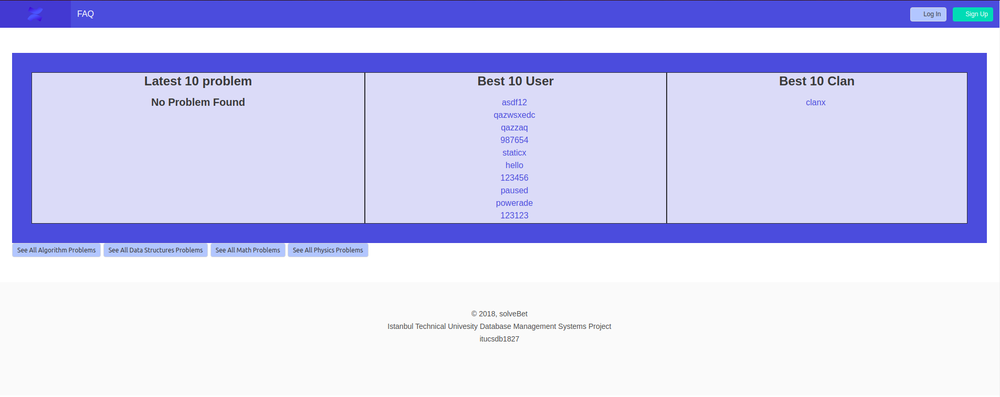
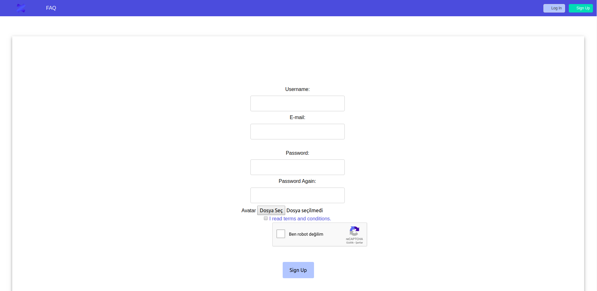
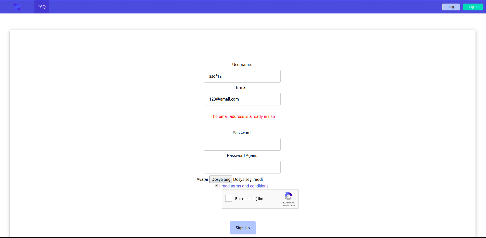
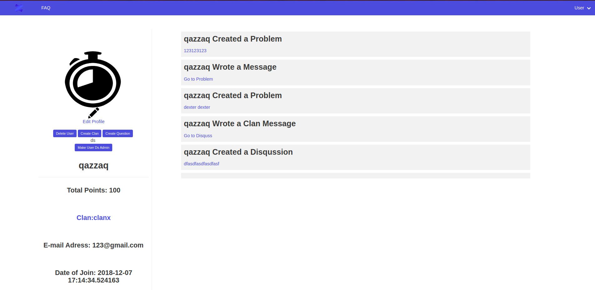
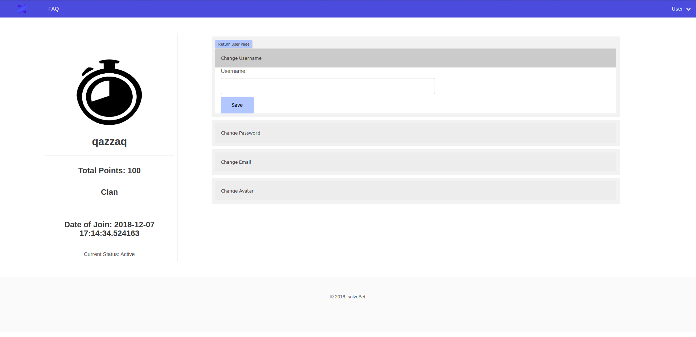
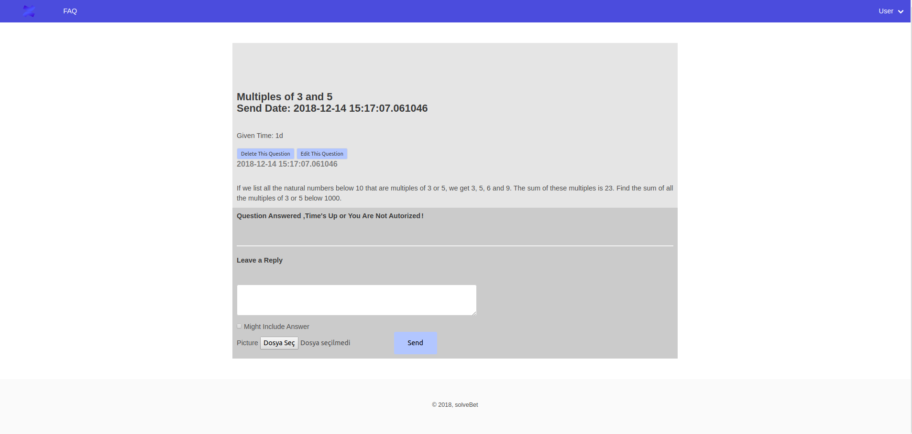
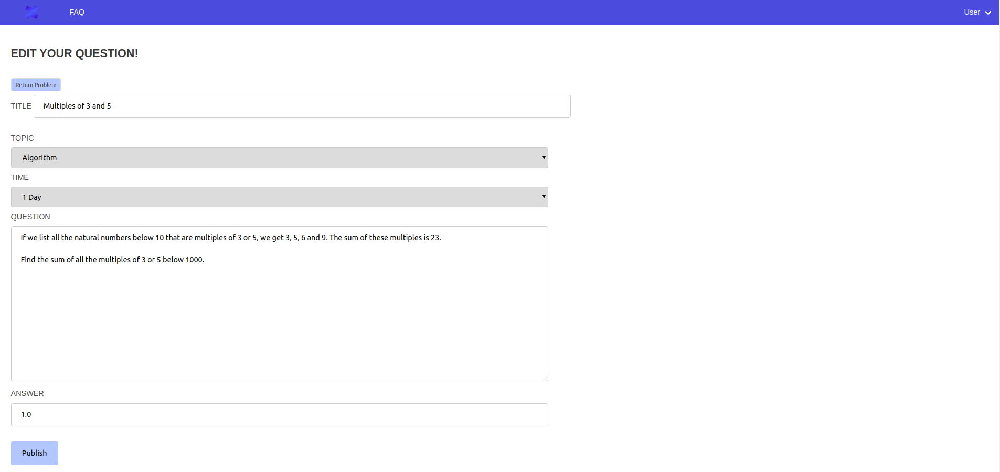
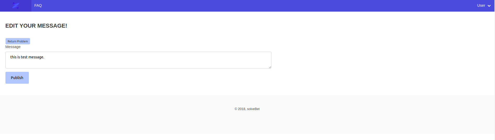
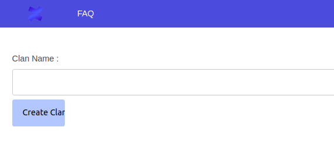
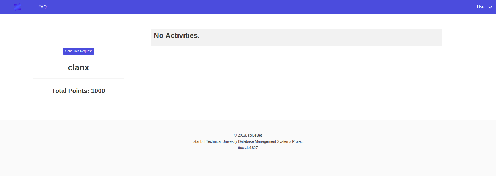

User Guide
==========

In this user guide, usage of solveBet will be explained. To see live demo please go to ''https://itucsdb1827.herokuapp.com/''

Main Page
---------

In main page, users can see latest activities 10, best 10 user, best 10 clan and redirect related pages.
In navigation bar, user can be redirected to main page by clicking logo of solveBet or if user clicks 'FAQ' button in navigaion bar, user will be redirected to frequently asked questions page. Also users can login or signup with buttons located in right part of navbar, if they are not logged or sign upped.

     Main page of solveBet

Login Page
----------

This is typical login form.It takes username and passwords. if login succeed , user will be redirected to user profile page. Even user isn't logged in, user can see problems  but they can not answer questions, leave reply, create clans or join clans .

     
     Login page of solveBet

Signup Page
-----------

In sign up form, users has to mark;

- username which has to be unique,
- email which has to be unique,
- 2 diffrent password field which has to be same,
- avatar upload button,
- terms and condition checkbox,
- recaptcha robot preventer.

If signup succeed, user will be redirected to user profile page.

     Signup page of solveBet

User Page
---------

In left part, three is users avatar,points and some other attributes of user.If the viewer of user page is same person with user who is in session, edit profile button can be seen otherwise that button will not be apppeared.Also with the buttons from left side user can create clan,create problem, and if user is admin and user can make other users admins. In the right side, users latests five actvivities can bee seen and redirectable.
By clicking delete user, user can delete himself/herself.

     User page of solveBet

Edit Profile Page 
-----------------

In this page there are 4 different forms for changing password, username, email, avatar. In left side, there is user attributes as user page.

     Edit profile page of solveBet

Problems Page
-------------

In this page, users can see problems, send answer for question with betting feature, leave replies and answer the replies. But for answering question there are 3 criteria. User can not answer question, if it is already answered. Users can not answer if they are in same clan with creator of question. If user is same person which ask question , he/she can not answer that question.
Also there user can upload image while sending message or mark checkbox named as 'Might Incude Answer' and message will be covered with black, unless cursor on messsage.
Finally, this problems page is used by clan disqussion page either. The only difference between these pages is in clan disqussion page users can not bet because it is not actuallly problem. It is topic like normal forums.
For deleting or editing quesion user can click 'edit question' or 'delete question' buttons in problem page. But this button will appear if and only if user is asker of question.

     Problems page of solveBet
     

Edit Problem Page
-----------------

In this page user can edit problems which was asked by that user. Title , Question , Time , Answer fied can be changed and this areas are prepopulated with old informations of that question.
Since, problems page is used by clan disqussion, this page is used by clan disqusssion too.

     Edit problem page of solveBet

Edit Message Page
-----------------

As it stated earlier, user can send messsages. If user wants to change content of message, he/she should click 'Edit Message' button in right side of that message.
Since, problems page is used by clan disqussion, this page is used by clan disqusssion too.

     Edit problem page of solveBet

Create Clan Page
----------------

Basically, in this page user can create clans but users, which wants to create clan, have to have at least 1000 points.Otherwise he/she faced with some errors.

     Create clan of solveBet

Clan Page
---------

As it stated earlier, user can create clans. User interface of this section pretty siilar to users page. In left side there are some attributes which is related to clan and in left side there is latest activities for clan.
If viewer of clan page is not a member of any clan. 'Send Join Request' page will be appeared. By clicking this button, head of clan will get a notification about that and head of clan can accept or deby that request.

     Clan page of solveBet

